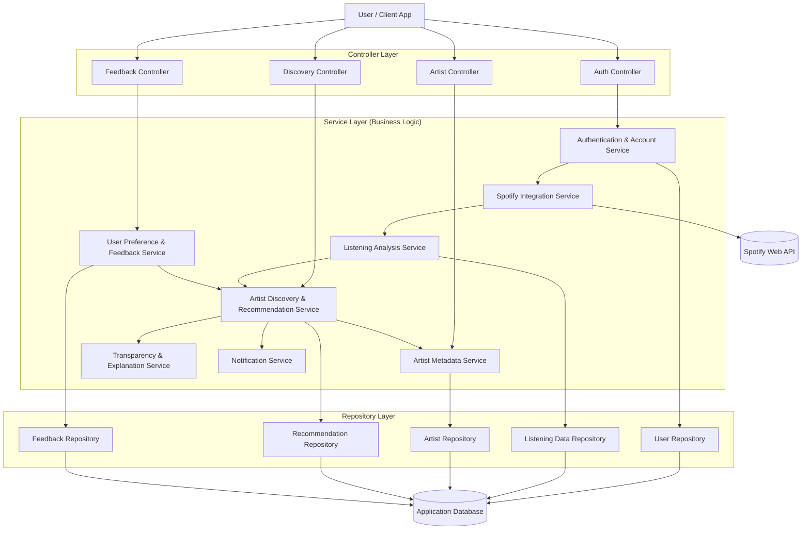

# Modular Monolithic Architecture Diagram

# Planning Update: Epics, Features, Stories

This planning update defines the feature hierarchy for final project scope and connects each feature to implementation tasks.

## Epic 1: Personalized Music Discovery

### Feature 1.1: Listening History Insights

- Story 1.1.1: As a user, I want to open a Listening History panel so I can start exploring my music activity.
    - Task: Add a dedicated Listening History tab and panel in the app dashboard.
- Story 1.1.2: As a user, I want to click a button and get listening results so I can verify the feature is working.
    - Task: Implement controller-to-service flow and display returned results in the view.
- Story 1.1.3: As a user, I want to see top tracks from my account so I can understand my playback trends.
    - Task: Implement service method for top tracks retrieval (placeholder now, Spotify data next).

### Feature 1.2: Artist Recommendation Feed

- Story 1.2.1: As a user, I want recommendations based on my listening patterns.
    - Task: Implement recommendation service method using listening signals.
- Story 1.2.2: As a user, I want to understand why an artist was recommended.
    - Task: Add explanation payload returned by recommendation service.

## Epic 2: User Preference Learning

### Feature 2.1: Feedback Capture

- Story 2.1.1: As a user, I want to like or skip recommendations.
    - Task: Add controller endpoint and view controls for feedback.
- Story 2.1.2: As a user, I want future recommendations to improve from my feedback.
    - Task: Add feedback-aware ranking logic in recommendation service.

### Feature 2.2: Preference Profiles

- Story 2.2.1: As a user, I want my genre and mood preferences reflected in recommendations.
    - Task: Add user preference model and persistence.

## Epic 3: Transparent Recommendation Experience

### Feature 3.1: Recommendation Explanations

- Story 3.1.1: As a user, I want plain-language explanations for recommendation results.
    - Task: Implement explanation builder in service layer and render in UI cards.

### Feature 3.2: Confidence and Source Metadata

- Story 3.2.1: As a user, I want to see confidence signals and source indicators.
    - Task: Extend recommendation response contract with confidence and source fields.

# Architectural Needs for Current Feature

Current implementation focus: Feature 1.1 Listening History Insights.

## Service Layer

- Implemented `ListeningService` package with placeholder methods to return feature data.
- Next step: replace placeholder with Spotify API-backed methods for top tracks and recent listening.

## Controller Layer

- Implemented `ListeningController` to call `ListeningService` and expose view-friendly data.
- Next step: add request validation and error mapping for external API failures.

## View Layer

- Implemented dedicated Listening History panel with button-driven service call and result rendering.
- Next step: add loading, error, and empty-state UX.

## Models and Repository (Planned Next Iteration)

- Not required for this week, but needed for persistence and personalization.
- Planned additions:
    - Pydantic models for listening items and preference summaries.
    - Repository layer for saved listening snapshots, feedback events, and recommendation history.
