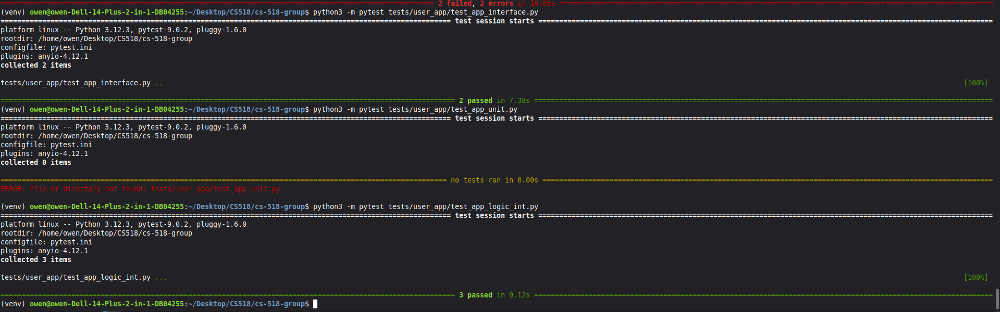

# Lab 6 Group Report - GUI

## Participants

- Mike Savio - mjs1438 (savio/lab-6-1)
- Anthony Holubiak - sah1081 (holubiak/Lab6.1)
- Owen Buhler - ob1054 (buhler/lab-6-1)

## Review

### Summary of Work Completed

This update added full GUI functionality to the application using NiceGUI, including login, registration, dashboard, and admin pages, along with a dedicated logic layer to manage user state and interactions. Environment-based configuration was implemented using a .env file and a config loader, and the application entry point was created with automatic admin seeding.

**Features Added:**
-Added app_functionality.md documentation
-Added app_exception_handling.md documentation
-Added .env file for database configuration and admin credentials
-Updated .gitignore to exclude .env
-Updated requirements.txt to include NiceGUI and required dependencies
-Added run_app.py as the GUI entry point with configuration loading and admin seeding
-Added config.py for environment variable loading
-Created new user_app GUI module
-Added user_app/__init__.py
-Added user_app/app.py with login, registration, dashboard, and admin pages
-Added user_app/logic.py for application logic and current user tracking
-Created new user_app test module
-Added user_app/tests/__init__.py
-Added test_app_logic_int.py for integration testing (logic layer to database)
-Added test_app_interface.py for interface testing with simulated user interactions

### Code & Testing Summary

** (2/26/26):**
When a user logs in via the form, do_login() calls AppLogic.login(), which delegates to UserService.authenticate() and returns a User object. The setter self.current_user = user stores it in app.storage.user['current_user'], which is isolated per NiceGUI session. When the dashboard loads, the getter retrieves the user from that same session storage. If a second user logs in simultaneously, their user object goes into their session's storage, keeping sessions completely isolated. On logout, the setter clears the storage for that session.

### Comparison of Versions
Mike Version: My version was fully complete with the user logins and set up for GUI functionality, and all tests passed but I was unable to get the full GUI to display on my end for some weird error reason. We worked together as a team to see how to get it to display with Owen’s device and decided to use his code because of the display of the GUI. 
Anthony Version: My implementation was complete however I had the same issue as Mike where i couldn’t get the actual app to open in the browser. All test cases were passed but still had no luck with it opening. Due to this we went with Owens code.
Owen Version: My implementation was complete and was able to pass tests. Mine also was able to open and function inside the browser and gave an actual usable interface. This is the reason we chose to use my code.

### Winning Code: Owen (ob1054)

Reasons listed in Code & Testing Summary above

## Retrospective

### Selection of Implementation

### Use of AI

For this lab we made our prompts without Ai then used the copilot integration with vscode to have it generate the files codes and test cases. We then ran the test cases to see if they passed and if not we looked at the error report to start working towards a solution. If the error was as simple as just installing a needed package we did that then re-ran the tests. If the solution was a bit more complex we would then prompt Ai again asking what solution it would do. If we liked the solution it was providing then we would tell it to implement the solution. If the solution that it gave us wasn’t exactly what we wanted we would give it an alternative solution or ask it to come up with another way. 

**Tools Used:** VS Code Copilot integration

**Models Used:** Claude Haiku

**Initial Prompt:**

[Initial Prompt file: 06_promps.md](../prompts/06_promps.md)

**Follow-up Actions:**

- Manual Edits: Simplified a lot of spaghetti code it wrote, made sure all tests aligned and passed. Debugged tests that were failing and added new fixes.

## Teamwork:

The new team is working out really well. It is a lot easier with group members that are actually participating. The main challenge is joining a new project mid way and trying to go over all the previous code to get an understanding of what is going on. Other than that everything has worked out really good for this lab. Now that we have everyone pulling their weight this is much easier.
